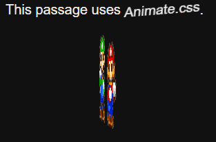
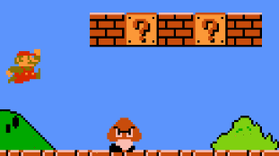
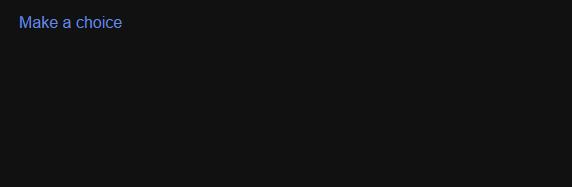
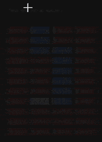
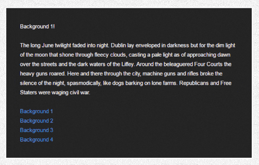

# Twine Resources

A in-progress collection of [SugarCube 2](http://www.motoslave.net/sugarcube/) resources for [Twine](https://twinery.org/).

Contents:

- demos - examples of various features and demos of how to integrate CSS & JS libraries into Twine 
    - animate.css ([link](demos/animate.css/), [live demo](//mikewesthad.com/twine-resources/demos/animate.css/example.html)) - for adding a set of pre-built animations into Twine. 
        
        

    - maps & defining clickable regions of an image ([link](demos/html-maps/), [live demo](//mikewesthad.com/twine-resources/demos/html-maps/example.html)) - for creating an image that has different areas that can be clicked. Also, includes the maphilight plugin for highlighting those areas when the player hovers over them.
        
        

- macros - custom macros for use with SugarCube 2
    - clickdialog and clickdialogchoice macros ([link](macros/clickdialog/), [live demo](//mikewesthad.com/twine-resources/macros/clickdialog/example.html)) - for creating dialog boxes.

        

    - keyboard macros ([link](macros/keyboard/), [live demo](//mikewesthad.com/twine-resources/macros/keyboard/example.html)) - detecting when a key is pressed or released.

        

    - mouse macros ([link](macros/mouse/), [live demo](//mikewesthad.com/twine-resources/macros/mouse/example.html)) - detecting when the mouse enters, leaves or moves over an element.

        

- css - examples of how to create different visual designs with CSS
    - bleached - Thomas Michael Edwards's bleached styling for SugarCube.
    - textbox ([link](css/textbox/), [live demo](//mikewesthad.com/twine-resources/css/textbox/example.html)) - creating a textbox around passages.

        

    - backgrounds ([link](css/backgrounds/), [live demo](//mikewesthad.com/twine-resources/css/backgrounds/example.html)) - creating passages that have images and gradients as backgrounds.

        

- hosting - tutorials on how to host your twines (or other web projects) online
    - Free hosting with GitHub pages ([link](hosting/readme.md))