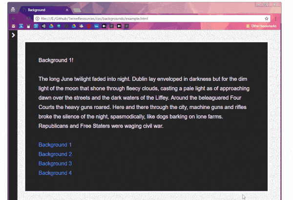

# Backgrounds Styling

See the [live demo](//mikewesthad.com/twine-resources/css/backgrounds/example.html). You can import example.html into Twine and open it up. The demo is heavily commented.

You can use the `background` property in CSS to load tiled images or single images behind your passage. This demo uses the textbox syling from the [../textbox/](textbox) demo. This demo also takes advantage of passage tags to apply different backgrounds to different passages.



## Resources

If you want to learn more about backgrounds in CSS, check out

- [csstricks tutorial on backgrounds](https://css-tricks.com/almanac/properties/b/background-image/)
- [w3schools tutorial on backgrounds](http://www.w3schools.com/css/css_background.asp) 

## Story Stylesheets

CSS from example.html:

```css
/* 
Make the body >= 100% the height of the page, so that backgrounds that fill the whole screen look as expected
*/
html, body {
	min-height: 100%;
}
body {
	display: inline-block; /* Fix: prevent "margin collapsing" */ 
}

/* 
A repeating background image (e.g. wallpaper)
This style applies to any passage with a tag of "repeating-background"
*/
body.repeating-background {
	background: url("http://mikewesthad.github.io/Class-TwineMedia/Images/Pattern_SwirlPattern.png");
}

/* 
A single image, centered and stretched to cover the page
This style applies to any passage with a tag of "single-background"
*/
body.single-background {
  	background: url("http://www.storywarren.com/wp-content/uploads/2016/09/space-1.jpg") center center / cover no-repeat;
}

/* 
A linear gradient of color
Generate gradient CSS here: colorzilla.com/gradient-editor
*/
body.linear-gradient {
  	background: linear-gradient(135deg, red, blue);
}

/* 
A radial gradient of color
Generate gradient CSS here: colorzilla.com/gradient-editor
*/
body.radial-gradient {
	background: radial-gradient(circle, #fcb900, #ff2b2b);
}

/* Text box styling */
#passages {
	/* Base size for the font inside the passage */
  	font-size: 20px;
  
  	/* Set a maximum width for the textbox */
  	max-width: 800px;
  
  	/* An outline around the textbox */
  	border: 5px solid white;
  	
  	/* A semi-transparent background color */
  	background-color: rgba(0, 0, 0, 0.85);
  
  	/* Space between the edges of the textbox and the text */
  	padding: 50px;
  
  	/* Round off the edges of the textbox */
  	border-radius: 5px;  
}
```
