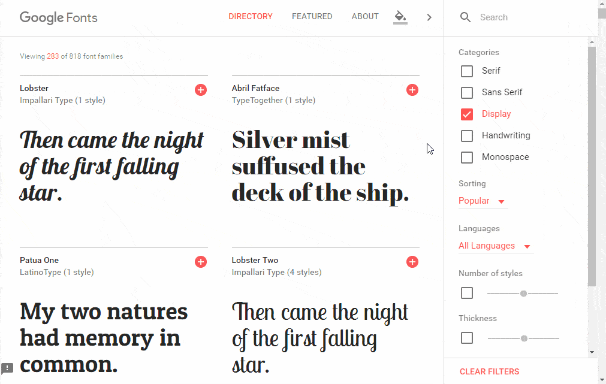

# Embedding Fonts

See the [live demos](//mikewesthad.com/twine-resources/demos/fonts/example.html) in example.html to see the library in action. You can import example.html into Twine and open it up. The demos are heavily commented.


## Font Family

The font family rule in CSS allows us to specify the font to use:

```css
body {
    /* Try to load Helvetica, if that doesn't work, load a generic sans-serif */
    font-family: "Helvetica", sans-serif;
}
```

But this will only work if the person viewing our twine has the Helvetica font installed on their computer. Mac users have Helvetica bundled with their OS, but Windows users do not. One solution is to use a "font stack" that specifies a series fallbacks (see [cssfontstack.com](cssfontstack.com)) for different operating systems. The other solution is to embed font files in your site.

Note: there are plenty more CSS properties for controlling the style of text. Check out w3schools on [fonts](http://www.w3schools.com/css/css_font.asp) and [text](http://www.w3schools.com/css/css_text.asp).

## Embedding Options

There are two ways we will look at for embedding font, but both rely on the [@font-face](http://www.miltonbayer.com/font-face/) CSS rule. This allows us to load font files (.ttf/.otf/etc.) from a server onto the viewer's computer.

We'll look at:

1. Using [Google Fonts](https://fonts.google.com/)
1. Embedding the fonts ourselves

## Google Fonts

[Google Fonts](https://fonts.google.com/) is a service that hosts fonts and CSS files that have the appropriate @font-face rules. It allows you to really easily integrate a new font into your twine.

1. Go to [fonts.google.com](https://fonts.google.com/)
1. Click the plus icon on a font (or fonts).
1. Click on the "Family Selected" box at the bottom of the screen.
1. (Optional) Customize your font by selecting which character sets and which font weights you want access to.
1. Click on "EMBED", then click on "@IMPORT". Copy the `@import url('...');` to your Twine's story stylesheet. This must go at the top of your stylesheet!
1. Apply the font to some element (e.g. the `body`) using the CSS given.

Ta da! Here's that process in GIF form:



**Note**: `@import` rules must come before anything else in your stylesheet.

## Embedding the Font Ourselves

What if you don't want to be limited by Google's font selection? You can find a slew of fonts online at [dafont](http://www.dafont.com/) and [fontsquirrel](https://www.fontsquirrel.com/). Then you can convert them into the appropriate font files and @font-face rules using fontsquirrel's [webfont generator](https://www.fontsquirrel.com/tools/webfont-generator).

1. Find and download a font from your choosen source. E.g. this [ransom font](http://www.dafont.com/ransom.font) by John Morris.
1. Upload the font files (.ttf, .otf, .woff, .woff2) to the [webfont generator](https://www.fontsquirrel.com/tools/webfont-generator), run the generator and download your font kit.
1. Open the font kit. You want to host this folder yourself. (See [hosting guide](../../hosting/readme.md).) Note: you only really need the CSS file and the font files (.woff, .woff2).

    If you open up your CSS file, you will see something like this. It defines a font-family (here, "ransomregular") and tells the browser where to find the files. It is important that you keep your font files right next to your CSS files when you upload everything to your server.

    ```css
    @font-face {
        font-family: 'ransomregular';
        src: url('ransom-webfont.woff2') format('woff2'),
            url('ransom-webfont.woff') format('woff');
        font-weight: normal;
        font-style: normal;
    }
    ```

1. In a Twine, link to your kit's CSS file using the `@import` rule. Since I uploaded the ransom font kit to this repository, my `@import` would look like this:

    ```css
    @import url("https://www.mikewesthad.com/twine-resources/demos/fonts/ransom-webfont/stylesheet.css");
    ```

    Note: if you are using Twine 2 in the browser, make sure you have set up your server to serve files using HTTPS. For GitHub pages, see [this guide](https://help.github.com/articles/securing-your-github-pages-site-with-https/).

1. Apply your font to some element on your page (e.g. body). The font-family must exactly match the font-family defined in your kit's @font-face!

    ```css
    body {
        font-family: "randomregular";
    }
    ```

## Data URLs

- TODO: embedding fonts directly in CSS via a [data URL](https://robinwinslow.uk/2013/06/20/loading-fonts-as-data-urls/)