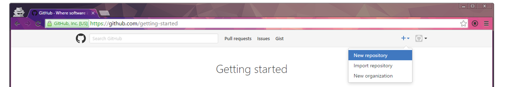
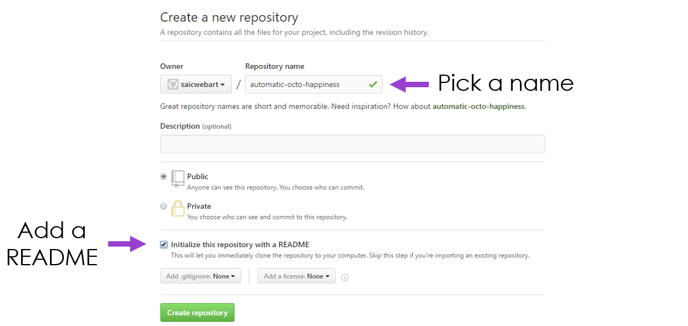
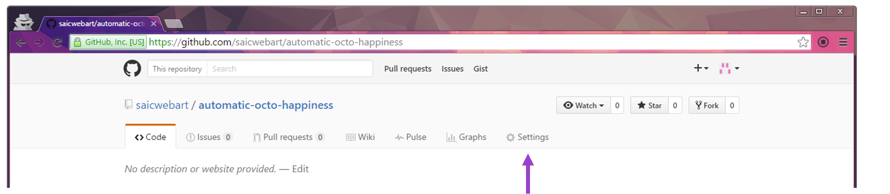
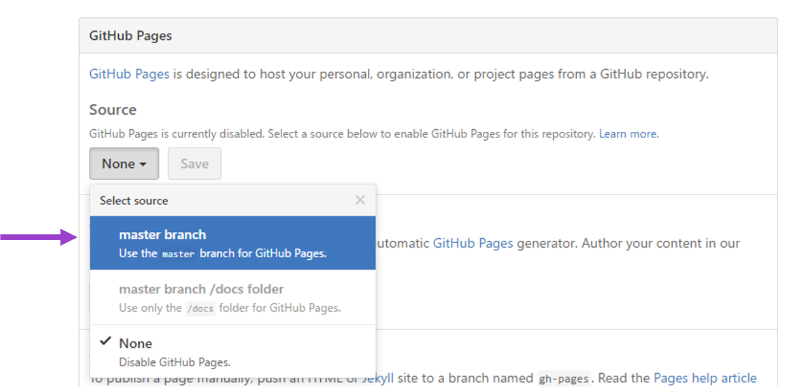
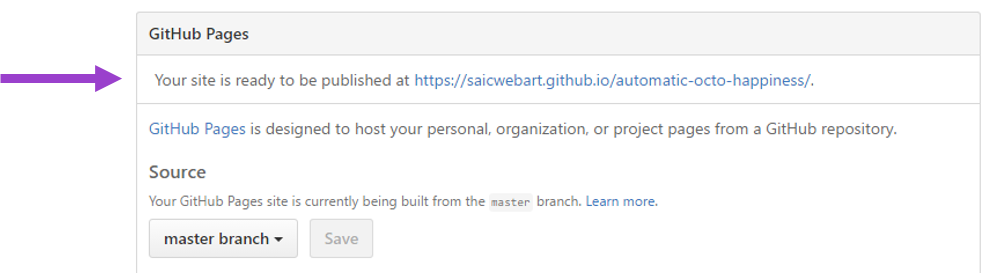
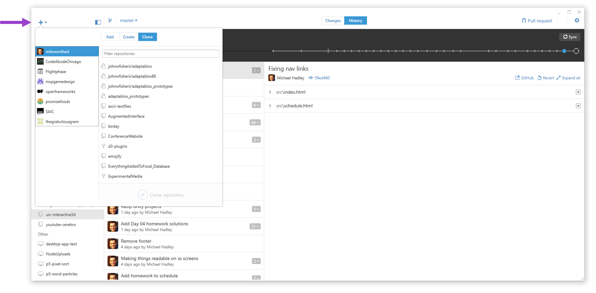
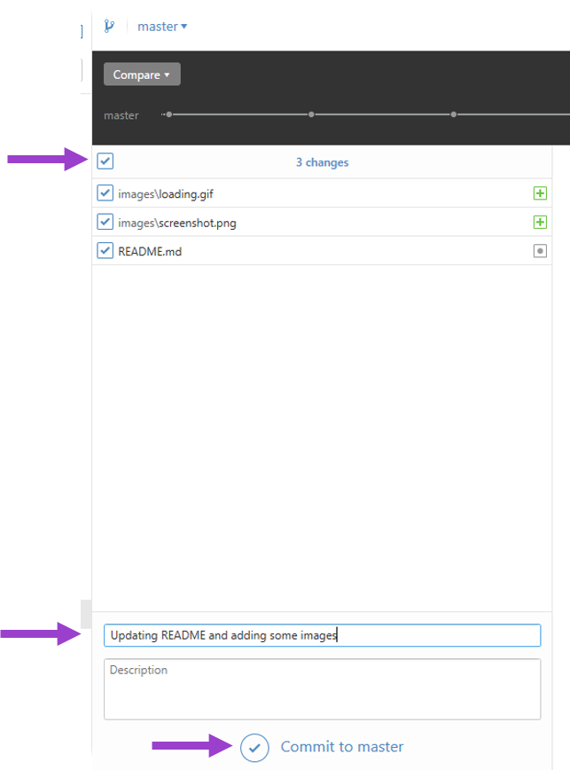
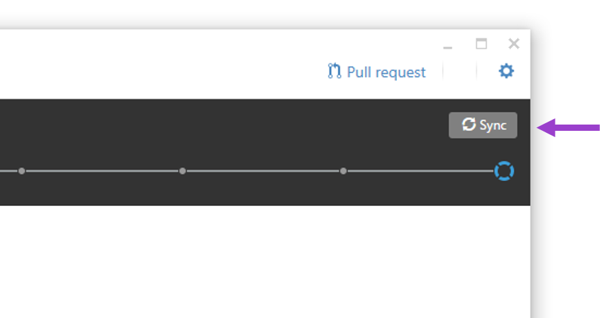

# Hosting Twines (and Other Web Projects)

There are many ways to put a web project online. [philome.la](http://philome.la/) is a common option for Twine. Just drag and drop a published HTML file. But what if you want to host your project yourself? Or what if you want to include your own images/sounds/video/etc. in your twine? And you don't want to pay anything? GitHub Pages to the rescue.

## GitHub Pages

[Git](https://git-scm.com/) is a version control software. Generally speaking, it provides a structured way to track the history of a project. [GitHub](https://github.com/) is a place where projects that use git can be hosted online. That's an incredibly brief background on the technology we will be using, but if you are curious, check out GitHub's [guides](https://guides.github.com/). 

[GitHub Pages](https://pages.github.com/) is a service that GitHub has rolled out that allows you to use GitHub to host a website for free. We'll take advantage of that for hosting our twines and any media that we want inside of our twine.

## First Time Setup

1. [Sign up](https://github.com/join) for a GitHub account if you don't have one. Don't forget to confirm your email address on the account. Pick a username that won't be a pain to type into a URL (see next section).
2. Download [GitHub Desktop](https://desktop.github.com/). This is a desktop application that will allow you to "sync" project files from your computer to GitHub's servers.

## Repository Setup

In git lingo, a "repository" (abbreviated as "repo") is a project. You can think of it as a special folder that lives on GitHub's servers. When we create a repo for web hosting, the default URL for your projects is going to be:

http://**username**.github.io/**repository**

You can choose to put all your twines into one repository, or spread them across multiple repositories. I recommend the former. Regardless, any time you create a new repo that you want to be set up as a website, you need to do the following: 

1. Start creating a new repository

2. Initial settings for the repository
    - Again, pick a name that isn't a pain to type into a URL.
    - Check the box for "Initialize this repository with a README." Strangely enough, this is necessary for us to be able to edit the repo settings.

3. We need to tell GitHub that our repo is a web project that should be hosted and accessible online. 
    - Go to Settings
    - Set the GitHub Pages source to "master branch".

4. Setup done! You should see a note about what URL to use to find your project. Right now there won't be anything interesting there.

## Syncing with GitHub Desktop

Whew, online repository set up. Now it's time to link that online repository with a local folder on our machine using GitHub Desktop.

1. Boot up GitHub Desktop. Sign in with your GitHub credentials, if you haven't already.
2. "Clone" the repository you created in the last section. Cloning is git lingo for downloading the repo from GitHub's servers to your local machine. Click the plus icon, click on the "Clone" tab and find your repository. When it prompts you, save it to someplace on your machine where you won't lose it.

3. Copy a twine project into the folder that you created on your local machine. If you don't have one handy, you can download [this example one](//mikewesthad.com/twine-resources/demos/animate.css/example.html). Tip: if you right click on the repository name in GitHub Desktop (left-hand sidebar), you'll see an option for "open in finder" or "open in explorer," which will take you directly to your folder.
4. Switch back to GitHub Desktop. We have made changes to the local copy of our repository and now it's time to "commit" those changes to let GitHub Desktop know about them. Committing is like taking a snapshot of the current state of our files. Click on your repository, click on the changes tab, check the box next to any files you want to save, add a message and then hit "commit to master".

5. Our changes have been registered by GitHub Desktop, time to push them to GitHub's servers. This will make them go live, so that we can access them from our GitHub Pages URL. Hit the sync button in the upper right corner.

Yes! Now your files are online. If you uploaded a file named example.html, it would be accessible from this URL:

http://**username**.github.io/**repository**/example.html

That may feel like a lot of steps the first time you do it, but I swear it becomes second nature after you do it a few times!

## Making Changes

Any time you make a change to an exisiting repository, you need to:

1. Commit
2. Sync

## TODO

- Tips about not using spaces in your URLs
- Tips on organizing your files into subdirectories
- Tips about linking to your hosted files from the Twine app